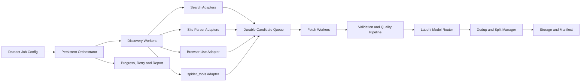

# 自适应通用图文多模态数据集爬虫设计

日期：2026-08-26
状态：Phase 1 基础内核已完成；Phase 2 多模态抽取与自适应路由已开始实施

## 1. 目标与边界

将当前 SmartSpider 升级为面向图文多模态数据集生产的通用采集平台，支持：

- 纯文本、纯图片、图文对、图文多轮样本和网页上下文样本；
- 图像分类只是其中一种任务模板；
- 单标签和多标签数据；
- 固定标签、自动发现标签和混合标签模式；
- 搜索引擎、站点解析器、Browser Use 动态探索和外部 spider_tools 多源采集；
- 本地模型优先、云端视觉模型/LLM 可选；
- 几千到几十万条多模态样本规模；
- 可恢复、可审计、可重跑的数据生产任务。

本阶段不要求立即建设微服务集群，也不把 LLM 直接放入下载和写盘关键路径。所有最终样本必须经过确定性的质量门禁，并保留来源、模型和过滤证据。

## 2. 总体架构



核心原则：来源发现、资源下载、质量评估、标签决策、存储提交彼此解耦；每个阶段都可以重试、跳过或从持久化状态恢复。

## 3. 核心组件

### 3.1 Dataset Job

任务配置包含：

- `job_id`、任务版本和创建时间；
- `modalities`、任务类型、标签定义、别名、负标签、互斥关系和阈值；
- 每个标签的目标数量和全局目标数量；
- 来源列表、搜索词、站点、页码和 Browser Use 探索限制；
- 本地/云端模型策略；
- 文本质量、图片质量、跨模态一致性、隐私和合规策略；
- 并发、限速、重试、磁盘保护和输出配置。

### 3.2 Discovery Adapter

统一接口：

```python
discover(task: DiscoveryTask) -> Iterable[CandidateResource]
```

候选资源至少包含：`url`、`modality`、`source`、`query`、`referer`、`page`、`title`、`alt`、`source_meta`。

搜索适配器负责扩大候选范围；SiteParser 负责稳定的结构化站点；Browser Use 负责动态页面、分页、懒加载、按钮和未知 DOM 探索。Browser Use 只产出候选资源和探索轨迹，不直接写入训练集。

### 3.3 Fetch Worker

负责 URL 状态机、请求策略、响应读取和下载临时文件。URL 状态至少包括：

```text
discovered -> leased -> fetched -> validated -> accepted/rejected
                         └-> retry_wait / failed
```

只有成功完成或明确终态的资源才进入持久化去重；临时网络失败不得永久污染去重集合。

### 3.4 Quality and Label Pipeline

根据任务类型执行可组合的质量管线：

```text
文本编码/清洗 → 图片格式/完整性 → 尺寸/亮度/方差/模糊
→ URL/内容/感知哈希去重 → 本地模型初筛
→ OCR/文本质量/跨模态一致性 → 标签与关系检查 → 样本提交
```

高置信度样本由本地模型快速处理；低置信度、冲突或新标签样本进入复核队列。云端模型结果必须记录模型版本、请求策略、时间、置信度和费用信息。

## 4. 标签策略

### fixed

只使用用户提供的标签，适合正式生产和严格可复现任务。

### discovery

从搜索词、标题、Alt、OCR、页面文本和视觉模型生成候选标签。新标签默认只能进入 `candidates.jsonl`，不能直接进入训练集。

### hybrid

固定标签用于正式标注，自动发现用于补充候选标签。候选标签经过阈值、最小支持数或人工复核后，才升级为正式标签。默认使用此模式。

标签模型支持：

- 多标签共存；
- 别名和多语言搜索词；
- 正标签、负标签和互斥标签；
- 每个标签独立分数和证据；
- 标签版本化，保证任务可重现。

## 5. 输出数据模型

训练入口以 `manifest.jsonl` 为准，文件目录不是样本事实来源。每条记录通过
`modalities` 表达资产，通过 `relations` 表达 caption-of、context-of、answer-to
等跨模态关系。

```json
{
  "id": "sha256:...",
  "task_type": "image_text_alignment",
  "modalities": [
    {
      "modality": "image",
      "role": "image",
      "uri": "images/000001.jpg",
      "asset_id": "img-1"
    },
    {
      "modality": "text",
      "role": "caption",
      "text": "一只猫坐在窗边。",
      "asset_id": "txt-1"
    }
  ],
  "relations": [
    {"source": "txt-1", "target": "img-1", "relation": "caption-of", "score": 0.97}
  ],
  "labels": [
    {"name": "cat", "score": 0.91, "source": "local_clip"},
    {"name": "outdoor", "score": 0.78, "source": "cloud_vision"}
  ],
  "quality": {
    "width": 1280,
    "height": 960,
    "file_size": 182734,
    "blur_score": 0.84,
    "phash": "..."
  },
  "provenance": {
    "source": "bing",
    "query": "cat outdoor",
    "url": "https://...",
    "captured_at": "2026-08-26T00:00:00Z"
  },
  "pipeline": {
    "job_id": "...",
    "policy_version": "v1",
    "status": "accepted"
  }
}
```

建议输出：

```text
images/
manifest.jsonl
candidates.jsonl
labels.json
splits.json
quality_report.json
events.jsonl
```

几千条样本时使用 JSONL + SQLite 即可；几十万条样本时增加 Parquet manifest 和分片索引，媒体、文本缓存仍可写入本地文件系统或对象存储。

## 6. 持久化与扩展策略

第一阶段使用 SQLite WAL 作为任务状态库：候选 URL、模态、租约、重试、模型结果、样本状态和错误都持久化。媒体、文本缓存和 manifest 写入文件系统。这样单机可以处理几千条样本，多个 worker 进程可以按模态、任务类型、来源或页码分片处理几十万条样本。

暂不引入 Redis、Kafka 或 Kubernetes。未来如果需要多机扩展，只替换任务队列和存储适配器，不改变 `DiscoveryAdapter`、`QualityPipeline` 和 `ManifestWriter` 接口。

## 7. 可靠性与失败处理

| 失败场景 | 处理策略 |
|---|---|
| 搜索引擎返回空结果 | 切换同模态来源，记录来源失败率 |
| 静态请求 403/JS 页面 | 转 Browser Use，限制探索预算 |
| 浏览器失败 | 回退静态源或进入重试队列 |
| 临时网络失败 | 指数退避，不写入永久去重状态 |
| 模型不可用 | 使用本地模型、规则或待复核状态 |
| 磁盘不足 | 暂停新任务，保留已提交 manifest |
| 任务中断 | SQLite 状态恢复 leased/retry_wait 任务 |
| 标签冲突 | 不直接进入训练集，写入 candidates |
| 重复图片 | URL 去重 + 感知哈希去重，避免数据泄漏 |

## 8. 实施阶段

### Phase 0：基础正确性

- 修复 `DatasetCrawler` 的 `PIL.Image` 导入问题；
- 修复 PagePerception 的 Response/bytes 类型错误；
- 修复打包后端和 CLI 打包问题；
- 修复 URL 去重过早提交和数据集编号并发问题；
- 补充真实下载到保存的集成测试。

### Phase 1：数据集任务内核

- 新增 JobConfig、LabelPolicy、CandidateResource、SampleRecord；
- 引入 SQLite 状态库和任务状态机；
- 把现有搜索、站点、spider_tools 接入 DiscoveryAdapter；
- 统一 Fetch、Quality、Dedup、Manifest 管线。

### Phase 2：自适应来源与标签

- 静态请求失败自动切换 Browser Use；
- 增加页面探索预算和探索轨迹；
- 增加标签发现、候选标签和复核队列；
- 增加本地优先/云端可选 ModelRouter。

### Phase 3：规模化与治理

- Parquet manifest 和分片索引；
- worker 进程分片和批量模型推理；
- 可选对象存储；
- 数据质量仪表板、成本统计和合规策略。

## 9. 验收标准

- 同一任务中断后可从 SQLite 恢复，不重复提交已成功样本；
- 多标签、多模态及跨模态关系样本可正确写入 manifest；
- 搜索、站点和 Browser Use 来源使用统一资源接口；
- 静态请求失败时可按策略切换浏览器；
- 临时网络失败不会污染永久去重状态；
- 质量过滤、模型结果和标签来源可追溯；
- 1000 张级别任务可在单机稳定完成；
- 100000 张级别任务可按分片和 worker 进程恢复执行；
- 核心模块测试覆盖率达到 70% 以上。
