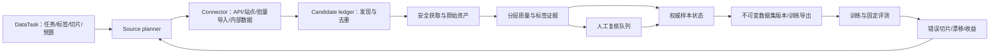

# smart-spider：面向模型冷启动与持续补数的生产化路线图

**日期：** 2026-10-08
**定位：** 设计建议，尚未实施
**依据：** 当前代码、[深度分析](../smart-spider-深度分析.md)、现有 ADR/S17–S20 路线图

## 1. 产品目标和交付定义

把 smart-spider 定位为**可追溯的训练数据供给系统**。一次任务的成功标准不应是“抓取了 N 个文件”，而是“交付了符合目标任务、来源可解释、质量可复核、版本可重现、能证明模型收益的数据集”。

系统要支持两类工作负载：

| 模式 | 输入 | 核心问题 | 交付 |
|---|---|---|---|
| 冷启动 | 任务定义、标签体系、允许来源、预算、目标切片 | 在缺少训练数据时取得覆盖面与可靠初始标签 | 首版训练集、独立验证/测试集、数据说明、质量抽检结果 |
| 持续补数 | 固定评测集、模型错误、低置信度样本、漂移切片 | 下一批数据应补哪个缺口，能否带来增益 | 增量数据版本、选择理由、训练前后切片评测、回滚能力 |

冷启动优先保证**代表性与标签定义**，持续补数优先保证**边际收益与避免评测泄漏**。同一个采集引擎可服务两种模式，但规划器、抽样方式和验收指标必须不同。

### 每批数据的最小验收卡

建议新增 `DatasetRelease` 或等价产物，至少包含：`task_type`、标签 schema 版本、来源/许可声明、样本与内容哈希、采集和处理版本、模型/阈值版本、按场景/来源/时间分布、精确/近重复结果、抽检与复核结论、切分策略、manifest digest、已知限制、训练/评测关联 ID。现有 [`SampleRecord`](../../smart_spider/dataset_contracts.py#L316-L390)、[`DatasetLineage`](../../smart_spider/dataset_lineage.py#L22-L69)、[`UnifiedReport`](../../smart_spider/report.py#L63-L93) 和 publish checklist 已覆盖其中一部分；应扩展而非另造平行 JSON。

对外发布或交付训练的条件是：资产可读取且哈希匹配；没有未解决的来源/授权问题；必需标签已审核；各切片质量达到任务约定；训练/验证/测试组间没有已知泄漏；版本可重建。具体准确率和样本量阈值应由目标模型与业务损失确定，不宜在爬虫中写死一个通用数值。

## 2. 目标架构

关键是把现有链路连接成闭环：发现来源、质量判断、人工复核、正式版本、训练评测、下一轮采集。连接采用明确事件和状态，不依赖多个工具分别改写同一批 JSONL。

### 2.1 任务契约先行

新增可序列化的 `DataTaskSpec`：目标模型任务（分类、检测、OCR、检索、图文匹配等）、样本单位、标签本体与版本、目标切片（场景/地域/设备/时间/光照等）、每切片目标、负样本策略、来源白名单和许可、允许模态、预算（页数/字节/推理/人工工时）、质量政策、导出格式。`DatasetCrawlConfig` 与 `MultimodalJobConfig` 保留为执行配置，由同一任务契约编译而来。

现有 `Modality` 枚举包含音频、视频，但多模态默认实际采集网页、文本、图片；`SampleRecord.labels` 偏分类标签。若要覆盖检测、分割、OCR、视频事件，应先扩展**带类型的标注对象**（bbox、polygon、span、time range、关联 asset 与坐标系），并提供 schema 迁移/验证。仅增加下载器而没有标注与评测契约，会制造无法直接训练的数据。

### 2.2 来源作为可运营资产

统一 `SourceConnector` 契约：能力、授权范围、发现游标、增量标识、速率策略、错误分类、来源置信度。保留现有搜索引擎、`SiteProfile` 和专用适配器；补充用户提供的数据导入、公开 API、合作方批量导出与内部合规数据源。优先使用稳定的 API/批量接口，网页解析作为确有需要的来源路径。每个 connector 都要有 fixture 契约测试、成功率和单位有效样本成本统计。

规划器按**缺口与边际产出**分配来源预算，而不是固定对每个关键词翻同样页数。冷启动时追求标签/场景覆盖与来源多样性；补数时根据错误切片、难例、近重复密度和新增样本的边际收益调预算。预算决策要记录在报告中，便于复现。

### 2.3 样本状态与版本

建议权威状态至少区分 `discovered → fetched → validated → needs_review → accepted → quarantined/revoked`，记录每次决定的规则版本、模型版本、证据与操作者。图片内容使用哈希寻址保存原始字节；派生 JPEG、缩略图、embedding、标注作为独立版本资产。新版本引用已有内容，避免每次过滤直接移动正式图片。

在现有 [`DatasetRepository`](../../smart_spider/dataset_repository.py#L39-L85) 上增加正式 quarantine/revoke 转移，并使过滤、恢复、导出从同一状态生成物化视图。现在 [`DatasetImageFilter.apply`](../../smart_spider/dataset_filter.py#L415-L500) 只改文件与 JSONL，会和 SQLite 真值冲突，这是扩大任务规模前必须修复的契约缺口。数据集版本应不可变；新一轮补数生成新 manifest/digest，旧版仍可读取。MLflow 的数据集记录采用 digest、source、schema/profile 与训练 run 关联，值得作为训练侧对接的参考，而不是强制把仓储迁到 MLflow。[参考：MLflow Dataset Tracking](https://mlflow.org/docs/latest/dataset/)

## 3. 按优先级实施

### P0：先修正确性、安全和恢复边界

| 工作项 | 现有位置 | 验收标准 |
|---|---|---|
| 过滤/隔离写入 SQLite 权威状态，JSONL 统一重建 | `dataset_filter.py`、`dataset_repository.py`、`dataset_state.py` | 隔离→重启→续爬→恢复循环后，DB、文件、manifest 数量和哈希一致 |
| 浏览器每个请求都应用站点授权，重定向后记录真实 URL | `browser.py`、`browser_playbook.py`、`site_policy.py` | 未授权第三方子请求/跳转不会发出；报告 final_url 正确 |
| robots 获取复用安全网络层，区分 4xx 不可用与网络/5xx 不可达 | `site_policy.py` | 网络/5xx 不可达时按政策拒绝；行为与 [RFC 9309](https://www.rfc-editor.org/rfc/rfc9309.html) 的错误分类一致 |
| 租约 fencing 与原子领取 | `pipeline/local_queue.py`、`redis_queue.py`、`worker.py` | 过期旧 worker 无法提交；领取中崩溃不丢任务；重复交付不重复提交样本 |
| 关键能力 fail-closed 或显式降级 | `dataset_crawler.py`、配置/报告 | 显式要求 CLIP/场景检测而依赖不可用时任务失败或被标记为不可交付，不静默交付 |
| 续跑总目标与内容去重语义统一 | `multimodal_job.py`、`smart_spider.py` | 重启/续跑后不超总量；下载失败可重试而非永久 `seen` |

这些是后续功能的前置条件。现有 S17–S20 已提供 SiteProfile、playbook、队列和报告，P0 是收紧其真实执行边界，而非重做这些功能。

### P1：把采集结果变成可训练数据产品

1. 实现 `DataTaskSpec` 与标注 schema 版本，明确样本单位、任务类型、切片、来源与预算。为检测/OCR/视频等任务先定结构化 annotation，再开发对应采集与标注器。
2. 建立分层质量决策：便宜的 MIME/尺寸/哈希检查 → 场景和文本/图像模型 → 高风险/低置信度人工复核。所有拒绝与晋级都保存证据，模型阈值在固定金标集上校准。拒绝不等于删除，保留可恢复状态。
3. 做可用的复核工作流：抽样、双人冲突处理、标签修订记录、反例库、审核 SLA。优先复核靠近阈值、稀缺切片和模型分歧样本；统计审核后的精度，不把模型分数当真实标签。
4. 数据集发布器生成不可变版本、manifest 校验、group-aware split、训练导出和数据说明。小规模继续使用 SQLite + JSONL/对象存储；只有当单机查询、分布式并发或训练吞吐成为实际瓶颈，再评估 Parquet/Delta 等表格式。[Delta 官方文档](https://docs.delta.io/)强调事务日志与模式约束，但迁移应由负载验证驱动。

### P2：形成模型反馈驱动的持续补数

1. 引入 `ModelFeedback`：模型版本、推理时间、预测/置信度、人工真值、错误类型、所属切片、关联样本 ID。日志只回传业务许可的数据和必要字段。
2. 选择策略从“抓更多”变为“选更有价值”：错误切片覆盖、模型不确定性、embedding 多样性、跨来源新颖度、低频场景、人工审核成本。先用透明的加权规则和离线回放，收集收益后再考虑复杂 bandit/主动学习算法。
3. 固定独立评测集，按切片比较补数前后模型表现；训练集与评测集按页面/域名/时间/视觉簇隔离，复用 [`LeakageSafeSplitter`](../../smart_spider/dataset_governance.py#L200)。每次发布记录新增唯一数、标签准确性估计、切片覆盖、训练后指标变化与单位有效样本成本。无增益时停采或调整来源。
4. 将来源、处理作业、数据集版本、训练 run 之间的关系写成事件或导出接口。现有 lineage/报告可作为起点，若接入组织级血缘系统，可映射 OpenLineage 的 run/job/dataset facets。[参考：OpenLineage Facets](https://openlineage.io/docs/spec/facets/)

### P3：按测得瓶颈扩展工业负载

建立按源/域的全局速率与并发预算、背压和任务优先级；按页发现、下载、推理、标注、导出拆工作队列，重试要幂等。图片数据集仓储当前明确只支持同进程多线程写同一目录；多 worker 写入前必须定义单写者、分片合并或真正多写者提交协议。Redis 插件先完成原子领取和 fencing，再作为水平扩展选项。

埋点从进程计数扩展到 `task_id → candidate_id → sample_id → dataset_version` 的关联 trace，统计每阶段延迟、失败原因、队列等待、每来源有效产出、门禁通过率与成本。OpenTelemetry 将 traces、metrics、logs 作为相关联的信号；指标标签应控制基数，原始 URL 不放进 metric label。[参考：OpenTelemetry Signals](https://opentelemetry.io/docs/concepts/signals/)、[Metrics](https://opentelemetry.io/docs/concepts/signals/metrics/)

## 4. 产品与工程指标

| 维度 | 指标 | 用途 |
|---|---|---|
| 有效供给 | `accepted_unique / fetched`、每来源每小时有效样本数 | 比较来源与准入损耗 |
| 覆盖 | 每标签/场景/设备/时间切片数量，长尾缺口 | 冷启动规划与补数优先级 |
| 质量 | 金标抽检 precision、复核一致性、门禁误拒率、近重复率 | 判断标签可用性与质量代价 |
| 可靠性 | 任务成功率、租约恢复、孤儿资产、DB/manifest 不一致数 | 证明可恢复性 |
| 合规与治理 | 无来源许可记录数、策略拒绝数、撤回传播完成率 | 发布前阻断与事后追溯 |
| 模型收益 | 固定评测集整体及切片指标增量、每千审核样本的收益 | 决定继续补哪一类数据 |
| 成本 | 每有效样本的网络、存储、推理、人工成本 | 决定来源和阈值 |

先测现状，再为每个具体数据任务设置目标。**必须为零**的工程错误包括：交付版本中缺失资产、哈希不匹配、已撤回样本仍出现在新版本、跨 split 已知重复组、授权范围外请求。模型质量和成本阈值则由业务场景确定。

## 5. 最小落地顺序与演示任务

选择一个可获得明确授权的代表任务，例如现有六类工业安全图片中的一个类别。先冻结标签定义和 200–500 条人工金标/独立评测样本；这个数量只是试点规模建议，是否足够要看错误率和切片数量。然后：

1. 完成 P0 的事务/站点策略/队列修复，并建立 crash、重定向、重复领取的端到端测试。
2. 用 `DataTaskSpec` 跑一次冷启动，交付不可变 v1、切片报告、抽检与训练导出。
3. 训练基线模型，按固定评测集输出错误切片；再做一轮针对性补数生成 v2。
4. 比较 v1/v2 的数据增量、人工成本和模型切片收益。能证明收益后，再扩展来源和其他任务类型。

这条路径优先验证“闭环是否真的改善模型”，然后再扩大页面覆盖、视频/音频能力或分布式吞吐。部署规模和存储格式应跟随已测得的任务需求。
