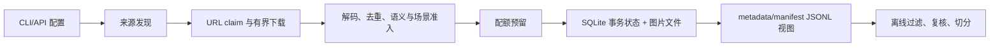

# smart-spider 深度理解分析

> 基于 2026-10-08 工作区代码的静态分析。本文描述实现行为；README 和 ADR 用来解释设计动机，不能替代代码证据。本轮环境没有安装 `pytest`，测试章节依据测试源码，未声称测试已运行通过。

## 理解验证状态

| 核心概念 | 能解释执行链 | 能说明设计理由 | 能指出边界 | 状态 |
|---|---|---|---|---|
| 通用关键词采集 | 是 | 是 | 是 | 已核实 |
| 图片数据集事务提交 | 是 | 是 | 是 | 已核实 |
| 多模态样本契约 | 是 | 是 | 是 | 已核实 |
| 授权站点浏览与队列 | 是 | 是 | 是 | 已核实 |
| 外部站点实时可用性 | 否 | 不适用 | 是 | 未联网验证 |

## 项目完整地图

项目是 Python 3.10+ 包，版本 2.2.0。包内有七十余个 Python 模块，另有大量 `tests/test_*.py`。根目录的 `spider.py`、`crawl_dataset.py`、`crawl_multimodal.py` 保留旧入口；[pyproject.toml](../pyproject.toml) 注册统一命令、独立工具命令和按需安装的 browser、video、text、filter、api、redis、s3 等 extras。

| 目录或文件组 | 职责 | 入口或关键文件 |
|---|---|---|
| `smart_spider.py`、`engines.py`、`http_client.py`、`browser.py` | 关键词搜索、网页获取、媒体处理 | `spider.py`、`smart_spider/cli.py` |
| `dataset_*.py`、`image_safety.py`、`scene_*.py` | 图片数据集采集、准入、落盘、恢复 | `dataset_cli.py`、`dataset_crawler.py` |
| `multimodal_*.py`、`dataset_contracts.py` | 网页/文本/图片样本及关系编排 | `multimodal_cli.py`、`multimodal_job.py` |
| `site_*.py`、`browser_playbook.py`、`browse_cli.py` | 定向站点图片采集与授权浏览 | `site_crawler.py`、`browse_cli.py` |
| `pipeline/`、`api.py`、`worker.py` | 本地/插件队列、对象存储、异步任务 | `pipeline/local_queue.py` |
| `dataset_filter*.py`、`dataset_governance.py` | 离线隔离、恢复、近重复、防泄漏划分 | `dataset_filter_cli.py` |
| `douyin.py`、`xiaohongshu_cli.py`、`image_retrieval.py`、`reverse_image_search.py` | 平台专用和图像检索工具 | 各自 CLI |
| `tests/`、`.github/workflows/ci.yml` | 单元与集成场景、Python 3.10/3.11/3.12 CI | `test_repository_crash_e2e.py` 等 |

命令入口在 [`cli.py`](../smart_spider/cli.py#L13-L75) 按子命令延迟导入。`smart-spider --keywords ...` 仍转给旧的 `spider.py`。这个兼容层降低迁移成本，却意味着“统一 CLI”只是统一分发，内部仍是多条不同执行链，配置、限速、去重与持久化语义不能一概而论。

## 1. 快速概览

这个项目最初是“搜索引擎发现 + 图片/视频/文本下载”的爬虫，现在向“可审计的数据集生产系统”发展。它至少有四条实质主线：通用关键词采集、图片数据集采集、多模态样本编排、授权站点浏览。项目还提供离线数据清洗、任务 API/worker、平台专用采集和本地/远程以图搜图。核心依赖是 `requests`、Pillow、NumPy、PyTorch；CLIP、Playwright、yt-dlp、trafilatura 以及 Redis/S3 能力按路径使用。`requirements.txt` 是兼容入口，安装与能力边界以 `pyproject.toml` 为准。

一条最有代表性的生产路径如下：



### 四条主线的差异

| 主线 | 主要输入 | 主要产物 | 权威状态 | 关键限制 |
|---|---|---|---|---|
| 通用采集 | 关键词、引擎、模态 | 关键词/模态目录下的媒体文件 | 进程内计数与去重状态 | 没有数据集事务契约 |
| 图片数据集 | 关键词/站点、场景目标、质量阈值 | 分桶图片、SQLite、JSONL、报告 | SQLite `dataset_items` | 以图片兼容格式为中心 |
| 多模态编排 | 来源、样本契约、路由配置 | 网页/文本/图片资产与关系 | SQLite + 对象存储接口 | 默认模态不含视频/音频 |
| 授权浏览 | SiteProfile、种子、playbook | 页面/链接结果、报告或任务状态 | 同步报告或队列任务 | 站点范围要跨浏览器请求落实 |

## 2. 背景与动机

### 问题本质

从公开网页收集可训练数据，难点不在一次下载，而在来源易变、网页可能要渲染、文件可能无效、样本会重复、场景标签可能缺证据、任务会在任意时刻中断。仅用一个搜索脚本，数量可以上来，但重启后的去重、数据血缘、质量审计与训练集泄漏都很难解释。项目因此把发现、准入、提交、复核与报告分成不同层。

### 方案选择的理由和代价

通用采集继续保留，服务交互式关键词任务；`DatasetCrawler` 保留既有图片目录格式，避免旧数据集和脚本一次性迁移；`MultimodalDatasetOrchestrator` 使用样本契约表达网页、文本、图片及其关系。这是 [ADR-0009](adr/0009-facade-convergence-and-storage-plugins.md) 的显式决策。代价是两个数据集门面仍有各自的流程与配额语义，共享接口不等于行为完全统一。存储接口可接本地文件/SQLite，也提供 Redis/S3 插件，但多进程一致性仍要检查具体插件实现。

### 适用场景

项目适合有明确来源、授权与质量标准的批量图片生产，也适合为网页内容建立轻量多模态样本。它不保证第三方页面结构稳定、登录后始终可访问，也不保证模型阈值天然准确。产出的场景门禁与发布清单可提供证据，但它们不能替代授权证明和人工验收。

## 3. 核心概念网络

### 发现与执行

`SearchEngine` 注册表把“如何构造查询 URL、如何从页面提取候选”抽出；`SmartSpider` 只管调度关键词、页数和模态 worker。这样新增静态引擎主要改解析器。需要浏览器的引擎由渲染路径处理，因此引擎配置和浏览器依赖之间仍有关联，不能仅看 CLI 的 `--use_browser` 开关。`BrowserUseAgent` 的 ReAct 循环是另一条显式工具调用路径，并非通用关键词采集的默认大脑；常规循环也不会自动进行 OCR 或 CLIP 识别，除非相应工具被调用。

### 候选、准入、提交

“候选”只代表发现了可尝试的 URL；“准入”要求下载的字节可解码、未重复，并通过所启用的语义/场景门禁；“提交”才占据正式样本索引。分开这些阶段的原因是网络失败、模型拒绝、配额竞争都可能在下载后发生。若发现时就加正式计数，配额会被失败候选消耗；若写文件后才分配索引，崩溃时会留下难以关联的孤儿文件。[`ImageDownloadSession`](../smart_spider/dataset_download_session.py) 负责 claim、槽位与失败释放；[`DatasetRepository`](../smart_spider/dataset_repository.py#L300-L395) 负责最终事务状态。

### 样本契约与视图

[`dataset_contracts.py`](../smart_spider/dataset_contracts.py) 把 asset、provenance、pipeline、标签与模态关系放在 `SampleRecord` 中。多模态不是简单地把三类文件放一个目录，而是表达一个页面与其文本、图片的 `contains`、`context-of`、`caption-of` 关系。SQLite 中的 committed row 才是图片数据集权威状态，`metadata.jsonl`/`manifest.jsonl` 是兼容视图。这让崩溃恢复有确定来源，也使任何离线工具必须同步更新权威状态，否则下次重建会回滚离线修改。

### 授权、网络安全与站点策略

[`URLPolicy`](../smart_spider/url_policy.py#L21-L112) 检查协议、凭据、localhost、私网/保留地址和 DNS/peer；`SiteCrawlPolicy` 则表达该任务允许访问的站点、robots、深度和速率。前者回答“目标网络地址安全吗”，后者回答“任务是否授权访问这个站点”。两者必须在每次真正发出的请求处同时生效。只在种子和抽取链接处校验站点策略，无法约束重定向或页面子资源。

| 依赖关系 | 为什么要这样接 |
|---|---|
| 引擎 → HTTP/浏览器 → 候选 | 页面形式和解析规则常变，网络层与发现层需分离 |
| 候选 → 准入 → 仓储 | 失败候选不能成为正式样本；提交需要一致索引 |
| SQLite → JSONL 视图 | 保留旧工具格式，同时提供可恢复真值 |
| SiteProfile → Playbook → 浏览器 | 授权范围应约束操作和所有网络请求 |
| 队列 → worker → 各任务门面 | API 可快速返回，长任务在进程外执行 |

## 4. 算法与理论

### 自适应来源路由

[`AdaptiveSourceRouter.discover`](../smart_spider/multimodal_pipeline.py#L538) 优先尝试静态 HTTP，遇到需要渲染或受阻信号时选择浏览器。单页解析开销大致与 HTML 长度及候选数线性相关；浏览器渲染的固定成本和内存占用显著更高。先尝试便宜路径可降低平均成本，但网页反爬行为和 DOM 变化会造成误判，最终仍要用采集成功率与候选质量观测路由效果。

### 去重、配额与并发窗口

URL claim 与源/最终内容哈希分别处理“同链接重试”和“不同链接同图”。哈希查询在索引有效时接近常数时间，计算字节哈希为 O(B)，B 是文件大小。下载窗口与域名并发上限将同时在途请求数限制在配置范围内，配额 ledger 把 pending 与 accepted 分开，避免多个线程同时突破目标。退化情况是搜索来源集中、同图多 URL 或模型准入率低：网络和推理工作仍消耗资源，最终样本数增长很慢。

### 防泄漏切分

[`LeakageSafeSplitter.plan`](../smart_spider/dataset_governance.py#L200) 先按域名、来源页面、时间桶和视觉簇建立连通组，再把整个组稳定分配给训练/验证/测试集。这比逐图片随机切分更重要：同一次拍摄或同网页转载图片跨集合会高估模型泛化。并查集的合并/查找摊还近似 O(α(n))；建立关系本身取决于输入规模。视觉 embedding 聚类的现有实现仍有 O(n²) 两两比较，分块仅降低峰值相似度矩阵内存，超大数据集应采用近邻索引或分桶。

## 5. 设计模式与系统边界

| 模式 | 位置 | 为什么使用 | 代价或边界 |
|---|---|---|---|
| 策略/注册表 | `engines.py`、`site_parser.py` | 各站点的 URL 与 HTML 差别大，调度器不必内嵌全部解析分支 | 页面变化仍需要逐站维护 |
| 门面 | `DatasetCrawler`、`MultimodalDatasetOrchestrator` | 保留面向任务的稳定入口，内部拆 discovery、ingest、commit | 双门面的选项和行为可能漂移 |
| 仓储与物化视图 | `DatasetRepository` | 事务状态集中，JSONL 可重建 | 离线工具不能绕开仓储修改视图 |
| 插件协议 | `pipeline/protocols.py` 与本地/Redis/S3 实现 | 任务和资产后端可替换 | 表面接口一致不代表原子性与租约语义一致 |
| 生产者消费者 | `SmartSpider` 搜索/推理/媒体 worker | 网络、推理与保存可并行 | 去重与目标数的时机需要跨线程协调 |

## 6. 关键代码深度解析

### 核心片段清单

| 编号 | 位置 | 优先级 | 选择理由 |
|---|---|---|---|
| #1 | [`DatasetCrawler._download_and_save`](../smart_spider/dataset_crawler.py#L1277-L1335) | 高 | 候选变成正式样本的总控点 |
| #2 | [`DatasetRepository.commit_image`](../smart_spider/dataset_repository.py#L300-L395) | 高 | 崩溃恢复与唯一性边界 |
| #3 | [`PersistentBrowserSession._route_handler`](../smart_spider/browser.py#L766-L792) | 高 | 浏览器真实出站请求的安全边界 |

### 片段 #1：从候选到正式图片

#### 1.1 代码整体作用

这个函数把一条发现 URL 处理成正式样本，或者清楚地拒绝它。它先取得会话，再拿下载槽位、校验图片、认领内容、执行语义/场景准入，最后提交文件并写统计。外层的 `finally: session.close()` 是关键：即使下载、模型或仓储发生异常，也应释放 claim、窗口和配额。上游是搜索引擎、定向站点或 spider_tools 发现；下游是仓储、JSONL 视图和报告。

#### 1.2 核心逻辑分析

输入 `(url, keyword, source)` 经 `begin → acquire → ingest → claim_content → admit → commit → record_saved` 输出布尔值。正常路径只在提交成功之后 `commit_success` 并加已保存统计。重复内容、解码失败、门禁拒绝、配额耗尽等路径返回 `False`，但原因应记到候选或运行统计。这里最重要的状态区分是“已尝试”和“已接受”；一个 URL 被发现并不代表它可成为训练样本。准入率很低时，用户看到的尝试数可能远高于目标量。

#### 1.3 核心代码与执行例

以下摘取连续主逻辑；例子设目标 100、当前已保存 40，候选 URL 是同一张已下载图片的新链接。

```python
if self._dir_manager.saved_count >= self.total_count:
    return False
session = self._begin_image_session(url, keyword, source)
if session is None:
    return False
scene_key, scene_profile, threshold = self._scene_context(keyword)
try:
    slot_error = session.acquire_slots()
    if slot_error:
        return session.fail(slot_error)
    ingested = self._accepted_ingest(
        session, self._ingest_session_image(session)
    )
    if ingested is None:
        return False
    if not session.claim_content(ingested.content):
        return session.reject("duplicate_content")
    admission = self._admit_ingested_image(
        ingested.image,
        keyword,
        scene_profile=scene_profile,
        threshold=threshold,
    )
    self._apply_admission_events(admission, keyword=keyword, url=url)
    if not admission.accepted:
        return session.reject(admission.reason)
    materialized = self._commit_admitted_image(
        session, ingested, admission,
        scene_key=scene_key,
        scene_profile=scene_profile,
        threshold=threshold,
    )
    if materialized is None:
        return False
    session.commit_success()
    self._record_saved(
        url=url, keyword=keyword,
        admission=admission, materialized=materialized,
    )
    return True
```

本例在 `claim_content` 返回 `False` 时进入 `duplicate_content`，不会占正式索引。换成新图且所有门禁通过，才会执行 `_commit_admitted_image`。若模型或仓储抛异常，外层 `except` 记录失败，`finally` 释放资源。代码中源字节去重发生在图像准入前，因此重复图不会再次耗费 CLIP 推理。

#### 1.4 关键设计点

把下载会话单独抽出，让网络和配额相关的清理逻辑集中在一个对象；否则每个拒绝分支都要手动回滚，很容易遗漏。把准入放在最终提交前，避免“文件已在正式目录但质量被拒”的状态。代价是已下载却未通过门禁的图片仍然花费带宽和解码时间。真正可扩展点是候选来源、语义门禁和场景信号，而不是复制整个下载函数。

#### 1.5 三组对比

- 新图、合格场景：claim 成功 → admission.accepted → 仓储 commit → `True`，已保存数从 40 变 41。
- 新图、缺少安全帽专用信号：claim 成功 → 门禁拒绝或进入复核队列 → `False`，正式数量仍为 40。
- 相同字节的新 URL：URL claim 可能成功，但内容 claim 返回重复 → `False`，不会重复推理或提交。

#### 1.6 使用注意与改进

采集目标数是正式接受量，而不是发现量，估算爬取页数时要考虑门禁通过率。启用 CLIP 的配置还应检查运行时是否真的加载成功：当前初始化失败会警告后关闭语义过滤，任务可能交付与配置不一致的样本。较稳妥的模式是当用户明确要求语义门禁时直接失败，或在最终报告中以显著字段标明降级。

### 片段 #2：崩溃可恢复的正式提交

#### 2.1 代码整体作用

`DatasetRepository` 解决“文件系统写入无法与 SQLite 原子提交”的问题。它先把图片写到私有 staging，向 SQLite 预留索引和去重键，再把记录转为 prepared、将文件原子 rename 到正式路径，最后标记 committed。启动时恢复 pending/prepared，并依据 SQLite 重建 JSONL。这样进程在任意一步崩溃，都能判断保留、补完或撤销。

#### 2.2 核心逻辑分析

状态链是 `staging → pending → prepared → final file → committed → JSONL`。未获预留意味着重复内容或数量已满，暂存文件直接删除；prepared 有正式文件或 staging 时可恢复；pending 且只有暂存文件则撤销。`_views_match` 比较文件路径顺序，不一致时调用 `rebuild_views`。这使 SQLite 成为真值，JSONL 成为可再生缓存。仓储文档明确只支持同一进程的并发线程，多个 writer 共同指向一个数据集目录不受支持。

#### 2.3 核心代码与执行例

设 URL A 的最终图片哈希为 H，仓储当前有 40 条 committed，`max_count=100`。连续的核心步骤如下：

```python
with self._lock:
    temporary = None
    reservation = None
    try:
        with tempfile.NamedTemporaryFile(
            mode="wb", dir=self.staging_dir,
            prefix=".item-", suffix=".tmp", delete=False,
        ) as handle:
            temporary = handle.name
            content_hash = write_bytes_with_sha256(
                handle, final_bytes, fsync=True
            )
        staging_relative = Path(temporary).relative_to(self.root).as_posix()
        reservation = self.state.reserve_dataset_item(
            self.job_id,
            content_hash=content_hash,
            source_hash=source_hash,
            staging_path=staging_relative,
            batch_size=self.batch_size,
            filename_token=filename_token,
            extension=extension,
            max_count=max_count,
            candidate_id=candidate_id,
        )
        if reservation["status"] != "reserved":
            os.unlink(temporary)
            return DatasetCommit(
                status=str(reservation["status"]),
                content_hash=content_hash,
            )
        index = int(reservation["index"])
        relative = str(reservation["relative_path"])
        absolute = self.root / relative
        sample, metadata = build_records(
            index, str(absolute), relative, content_hash
        )
        self.state.prepare_dataset_item(
            int(reservation["item_id"]), metadata, sample.to_dict()
        )
        absolute.parent.mkdir(parents=True, exist_ok=True)
        os.replace(temporary, absolute)
        temporary = None
        self.state.finalize_dataset_item(int(reservation["item_id"]))
```

当预留成功时，索引从 40 分配到下一位置；同哈希再次进入时，预留返回非 `reserved`，不会新增记录。`fsync` 增加单图写入成本，但让 staging 在崩溃后更可信。`os.replace` 保证最终文件名不会暴露半写入字节；数据库无法与 rename 同一事务，故用 prepared 状态恢复跨介质的不一致窗口。

#### 2.4 关键设计点

这是“事务外盒”式的状态机，而非真正跨 SQLite 与文件系统的原子事务。它依靠幂等预留、明确中间态和重启修复，换取普通本地文件系统上的可恢复性。JSONL 在提交成功后追加，追加失败会重建；但离线工具直接改 JSONL 时，仓储下一次初始化会按数据库覆盖它。并发范围要严格按类注释理解：同进程线程受锁保护，多进程同时写同一根目录会争夺 JSONL 发布。

#### 2.5 三组对比

- 正常：H 未见过，分配索引，prepared 后 rename，最终 committed，视图增加一行。
- 重复：H 已存在，预留返回重复，staging 被删除，样本数不变。
- 崩溃：prepared 后、rename 前退出，下次初始化发现 staging 并补 rename；若连 staging 也不存在，则撤销该未完成项。

#### 2.6 使用注意与改进

凡是要删除、隔离或修改正式样本的工具，应先通过仓储或状态层写变更，再重建 JSONL。当前 `DatasetImageFilter.apply` 只移动文件并重写 JSONL，与这一契约冲突：恢复可能重新发布已经隔离的行，同时报告原正式文件缺失。建议为样本增添 quarantine 状态和事务化迁移，并加入“过滤后重启仓储”的端到端测试。

### 片段 #3：浏览器出站请求与站点授权

#### 3.1 代码整体作用

浏览器页面加载会自动发起脚本、图片、样式、XHR 和导航请求，因此仅检查用户输入的种子 URL 不够。`PersistentBrowserSession` 对页面安装 route，在每个请求上调用 `URLPolicy`，再丢弃一部分资源类型与域名。Playbook 在种子与解析出的链接上另用 `SiteCrawlPolicy` 检查白名单、robots 和 BFS 深度。两处校验目前不完全重合，这是授权边界的关键。

#### 3.2 核心逻辑分析

流程是 `seed → SiteCrawlPolicy → page.goto → route → URLPolicy → 浏览器请求`。Playbook 可拒绝一个不在 `allow_hosts` 中的抽取链接，但已授权页面引入的第三方子资源仍会进入 route；route 只拒绝危险网络地址和预设阻断资源，没有检查 `allow_hosts`。导航重定向也会由浏览器处理，`_current_url` 在 `goto` 后被写成原始请求 URL，而非 `page.url`。因此最终 URL 以及相对链接基址可能不准确。

#### 3.3 核心代码与执行例

例子：允许 `example.com`，该页包含 `https://other-public.example/track.js`。相关真实代码如下：

```python
self._page = await self._context.new_page()
await self._page.route("**/*", self._route_handler)

if _STEALTH_AVAILABLE:
    await stealth_async(self._page)
else:
    await self._page.add_init_script(_STEALTH_JS_MINIMAL)

logger.info(f"PersistentBrowserSession ready (headless={self._headless})")

async def _route_handler(self, route):
    """拦截并丢弃不必要的资源请求。"""
    req = route.request
    if not _validate_browser_request(req.url, self.url_policy):
        await route.abort()
        return
    if req.resource_type in _BLOCK_RESOURCE_TYPES:
        await route.abort()
        return
    for domain in _BLOCK_DOMAINS:
        if domain in req.url:
            await route.abort()
            return
    await route.continue_()

async def _navigate_async(self, url: str, wait_for: str = "networkidle") -> str:
    if self._page is None:
        return ""
    try:
        url = self.url_policy.validate(url)
        await self._page.goto(url, wait_until=wait_for, timeout=self._page_timeout)
        await self._simulate_human(self._page)
        self._current_url = url
        html = await self._page.content()
```

`other-public.example` 是公网时会通过 URLPolicy；若资源类型不在阻断集合，route 会放行。相比之下，Playbook 的 [`_browse_page`](../smart_spider/browser_playbook.py#L156-L228) 对种子和抽取链接调用 `policy.allows_url`。差别不是理论上的：浏览器发请求的实际边界在 route，而站点白名单没有被传到那里。

#### 3.4 关键设计点

通用 URLPolicy 能减少 SSRF 风险，包括浏览器中的私网请求；站点白名单则限制任务授权范围，作用不同。完整实现应在 route 对每个导航及子资源应用明确策略，并决定外部静态资源是否有授权例外；如果业务允许 CDN，也应显式列入资源白名单。robots 获取目前用 `urllib.urlopen` 且失败时放行，不走统一 HTTP 安全路径。需要把 robots 请求纳入同一 URL 校验与可观测策略，否则“已启用安全 URLPolicy”不能推论所有出站请求都受它保护。

#### 3.5 三组对比

- 同站导航：种子/链接通过 SiteCrawlPolicy，route 通过 URLPolicy，请求继续。
- 公网第三方子资源：Playbook 没有把它当作链接检查；route 只看 URLPolicy，可能继续请求。
- 私网子资源：即使页面来自白名单，URLPolicy 通常会拒绝私网/保留地址，route 中止请求。

#### 3.6 使用注意与改进

`allow_hosts` 当前不应被理解为浏览器所有出站流量的完整保证。报告中的 `final_url` 也可能保留请求前地址，重定向场景应以 `page.url` 更新。建议优先加入重定向/子资源的端到端测试，并让浏览器 route 同时应用安全地址规则与授权站点规则；对 robots 的获取也应用同一网络安全边界。

## 7. 测试用例分析

| 功能 | 主要测试 | 观察到的覆盖 |
|---|---|---|
| 引擎解析、通用爬取 worker | `test_engines.py`、`test_engine_html_fixtures.py`、`test_round3.py`、`test_round4.py` | 解析器、模态完成、图片入队 |
| HTTP 地址与资源上限 | `test_http_client.py`、`test_browser_security.py` | 字节限制、私网跳转、浏览器请求拦截 |
| 图片仓储与崩溃恢复 | `test_dataset_repository.py`、`test_repository_crash_e2e.py` | 预留、恢复、重建视图 |
| 场景质量与治理 | `test_scene_gate_truth.py`、`test_scene_quality_integration.py`、`test_dataset_governance.py` | 拒绝证据、配额、防泄漏分组 |
| 离线过滤与恢复 | `test_dataset_filter.py`、`test_dataset_lineage.py` | dry-run、隔离、恢复、近重复 |
| 多模态与任务执行 | `test_multimodal_job.py`、`test_multimodal_pipeline.py`、`test_worker.py`、`test_pipeline_plugins.py` | 样本关系、提交、worker、插件 |
| 授权浏览 | `test_browser_playbook.py`、`test_site_policy.py`、`test_site_profile.py` | playbook、策略、profile |

测试给出的一个重要边界是“局部行为正确”不代表“跨工具一致”：仓储恢复和过滤恢复各自有测试，但未见覆盖“先过滤，再重开仓储”的组合测试。浏览器有 URL 安全测试，也需要“白名单页面加载公网第三方资源/跳转”的策略测试。CI 在 Python 3.10、3.11、3.12 上运行核心测试，并把重型 ML 依赖以跳过或 stub 处理；因此 CI 通过不能证明真实 CLIP 模型或外部页面在当前网络上的可用性。本轮本地执行 `python -m pytest -q` 返回 `No module named pytest`，未执行测试。

## 8. 应用迁移场景

### 从工业安全图片迁移到商品目录

保留“发现 → 安全下载 → 内容去重 → 准入 → 仓储 → 治理”的主链；将场景提示词、必需信号、来源配额和样本标签改成商品类目、主图质量、品牌/授权来源。这样可复用稳定的网络与事务基础，不把工业场景阈值错误地套到商品图片上。商品多角度照片不应被近重复规则一概隔离，必须重新校准视觉聚类阈值。

### 从授权文档站迁移到内部知识库

保留 SiteProfile、playbook、BFS 与网页/文本关系模型，换成明确允许的域名、登录状态、页面选择器和发布清单。内网任务若确实需要私网地址，需显式配置 `allow_private_hosts`，同时把授权范围落实到浏览器所有请求与 robots 获取。这个场景强调通用 URL 安全和组织授权是两个独立约束，不能互相替代。

## 9. 依赖关系与使用示例

基础安装与轻量 smoke 以 README 和 `pyproject.toml` 为准。Playwright 用于动态页面，缺它时动态引擎不能运行；CLIP/torch 支撑图片语义评分，缺它时图片数据集采集可能降级；`yt-dlp` 处理没有 MP4 直链的视频；`trafilatura` 提取文章正文。SQLite/本地文件是默认任务与资产后端，Redis/S3 是可选插件。选择默认本地后端便于单机复现，跨机器部署时要重新验证队列领取原子性、租约和对象存储一致性。

```bash
# 交互式关键词采集：按关键词/模态写 output
smart-spider crawl --keywords 猫咪 --media_types image --max_items 50

# 有状态图片数据集：记录 SQLite 真值、视图和报告
smart-spider dataset --keywords "helmet" --total 100 --output ./dataset_helmet

# 授权浏览：配置明确种子、白名单、步骤和深度
smart-spider browse --profile ./site.yaml --once

# 离线过滤先试跑；正式隔离前审查决策报告
smart-spider filter --dataset ./dataset_helmet --query "helmet" --limit 100
```

命令仅展示路径与参数形状，不能作为本轮运行结果。包含真实账号、Cookie 或外部站点的任务，还依赖该站点当前页面与授权条件。

## 10. 质量验证与改进顺序

### 最高优先级：跨模块正确性与边界

1. **让离线隔离与 SQLite 状态一致。** [`DatasetImageFilter.apply`](../smart_spider/dataset_filter.py#L415-L500) 移动文件并重写 JSONL；[`DatasetRepository.__init__`](../smart_spider/dataset_repository.py#L73-L85) 会按 SQLite 重建不匹配视图。这是代码直接推出的冲突。先定义 quarantine 在权威状态中的表达，再做可恢复迁移和组合测试。
2. **让站点授权覆盖浏览器真实出站请求。** [`browser.py`](../smart_spider/browser.py#L766-L792) 的 route 只有 URLPolicy；Playbook 的站点白名单只用于种子/抽链。将 policy 传入 route，明确第三方资源与跳转规则；重定向后更新 `page.url`。`site_policy.py` 的 robots 获取也应走安全网络层。
3. **为队列完成操作加领取代次/所有权校验。** [`local_queue.py`](../smart_spider/pipeline/local_queue.py#L189-L227) 的 complete 只按 task_id 更新。租约过期且任务被别的 worker 重新领取后，旧 worker 仍可能覆盖新状态。Redis 领取实现的 `rpop → _save → zadd` 也有中间崩溃窗口，应使用原子脚本或可靠队列机制。

### 次优先级：语义与规模

4. **显式报告 CLIP 降级。** 配置要求语义过滤而依赖不可用时，当前图片采集会警告后继续；应让用户可选择失败或有明确标记的降级结果。
5. **统一续跑目标数。** 多模态 `max_samples` 目前依据本次 `report.accepted`，需要核对已提交总量，避免续跑越过预期总目标。
6. **核实通用采集去重时机。** [`smart_spider.py`](../smart_spider/smart_spider.py#L681-L683) 在入队/下载成功前调用 `is_seen`，失败或队列满可能令断点续采永久跳过候选。`dedup.py` 已有 claim/commit/release 语义可复用。
7. **补强动态引擎与配额可观测性。** 小红书旧引擎忽略 page 参数；动态引擎即使未传 `--use_browser` 也可能启动浏览器。并发视频 worker 的保存数也可能超过 target。应让 CLI 帮助、依赖检查与实际调度一致。

### 验证清单

| 问题 | 本轮结论 |
|---|---|
| 能否从命令追踪到采集、准入和持久化？ | 能，四条主线已分别标注 |
| 能否解释为何使用 SQLite + JSONL？ | 能，真值与兼容视图分工清楚 |
| 能否说明安全地址和授权站点的区别？ | 能，两层策略及遗漏点已核实 |
| 能否证明外部站点采集成功率？ | 不能，本轮没有实时联网任务 |
| 能否证明测试当前通过？ | 不能，本地无 pytest；仅核对测试源码与 CI 配置 |

这份分析的最终判断是：项目已经具备数据集生产所需的大部分独立构件，尤其是图片准入、事务恢复和治理能力；当前最需要收口的是**跨工具一致性**与**真实出站/并发边界**。这些问题不是单个模块的功能缺失，而是模块各自正确时，在组合使用中暴露出的契约缝隙。
